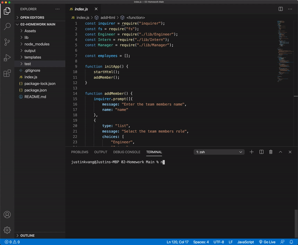
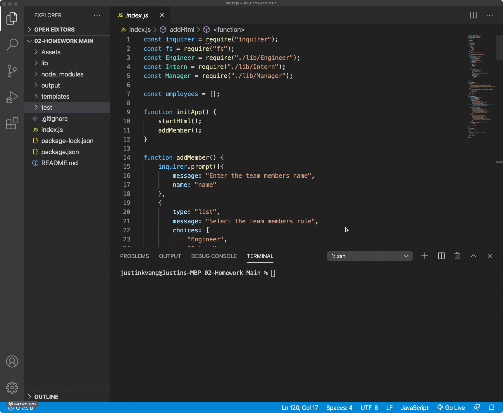

  <h1 align="center">Team Profile Generator</h1>
  
   

  ## Description
  My task was to build a Node.js command-line application that takes in information about employees on a software engineering team, then generates an HTML webpage that displays summaries for each person. Testing is key to making code maintainable, so writing a unit test for every part of my code to ensure that it passes each test.

  ## Table of Contents
  - [Description](#description)
  - [Installation](#installation)
  - [Usage](#usage)
  - [License](#license)
  - [Contributing](#contributing)
  - [Tests](#test)
  - [Questions](#questions)

  ## Installation
  To generate your own README, first run `npm i` in order to install the dependencies. The application itself can be invoked with `node index.js`.

  ## Usage
  
  
  When you run `node index.js`, the application uses the `inquirer` package to prompt you in the command line with a series of questions.

  The application then takes your response and will generate populate the `team.html` file in the folder output. 

  Once this is done, open your `team.html` in your web broswer and you can see your team members!

  ## License
  [MIT License](https://choosealicense.com/licenses/mit/)

  ## Contributing
  Please message with me any errors or improvements you may have. See the [Questions](#questions) section to contact me.

  ## Test
  
  To test the application, locate the `index.js` file and open the intergrated terminal from that file. In the command line, write `npm test` and press enter. 

  ## Questions
  - My GitHub profile: [justinkvang](http://github.com/justinkvang)
  - My GitHub repository: [justinkvang](http://github.com/justinkvang?tab=repositories)
  - Email me with any questions: justinvang07@gmail.com
